# Q-learning-CNN-in-Flappy-Bird-Enviroment

A Deep Q-Learning agent that learns to play Flappy Bird directly from pixels using a CNN in PyTorch. 
The Q-learning algorithm is implemented from scratch.

# Core Focus

-   Reinforcement Learning
-   Convolutional Neural Networks
-   Stabilization techniques:
    -   Replay buffer
    -   Target network
    -   Epsilon-greedy exploration
    -   Gradient clipping

## Trained Agent
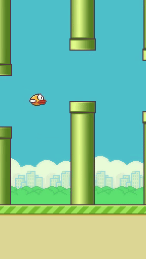

## Preprocessing
The agent is trained **purely from pixels**, without access to game state variables.  

Each frame undergoes a preprocessing pipeline to reduce noise while preserving task-relevant information.


1. **Cropping**
    
    -   Removes irrelevant UI elements (ground, score area, sky margins).
        
    -   Focuses attention on the region where decisions matter.
        
 2.   **Background Removal**

2.   **Turn Grayscale**
	 -   Turns the input into a single channel (instead of 3 - RGB).
  
        
4.  **Resizing to 84×84**
    -   Balances spatial detail and computational efficiency.
        
5.   **Normalization**
     -   Pixel values scaled to `[0, 1]` for stable neural network training.

## Architecture

The input consists of 4 consecutive frames of the enviroment so the network can extract information about the velocity and the direction that the bird is going to.

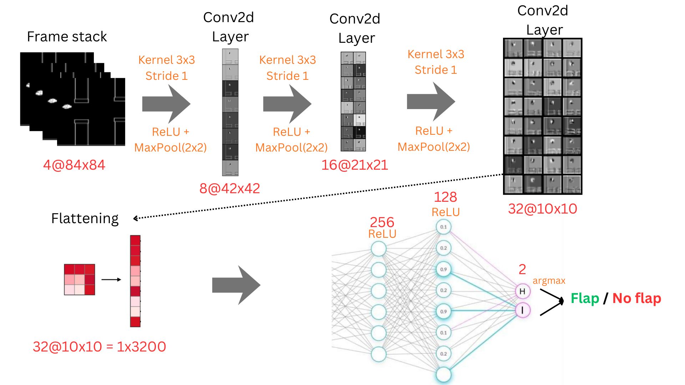
```python
self.pool = nn.MaxPool2d(2, 2)

self.conv1 = nn.Conv2d(in_channels=frame_skip, out_channels=8, kernel_size=3, stride=1, padding=1)
self.conv2 = nn.Conv2d(in_channels=8, out_channels=16, kernel_size=3, stride=1, padding=1)
self.conv3 = nn.Conv2d(in_channels=16, out_channels=32, kernel_size=3, stride=1, padding=1)

self.fc1 = nn.Linear(32 * 10 * 10, 256)
self.fc2 = nn.Linear(256, 128)
self.fc3 = nn.Linear(128, 2)

self.net = nn.Sequential(
	self.conv1,
	nn.ReLU(),
	self.pool,

	self.conv2,
	nn.ReLU(),
	self.pool,

	self.conv3,
	nn.ReLU(),
	self.pool,

	nn.Flatten(),

	self.fc1,
	nn.LayerNorm(256),
	nn.ReLU(),

	self.fc2,
	nn.LayerNorm(128),
	nn.ReLU(),

	self.fc3
)
```

## Hyperparameters

```python
# Environment
frame_skip  =  4
train_every  =  4

# Training
data_type  =  torch.float32
batch_size  =  64
T_iterations  =  100000 # episodes

# Replay buffer
replay_buffer_size  =  30000

# DQN
alpha  =  1e-4
gamma  =  0.99

# Target network (soft update)
target_network_incorporation_rate  =  0.005

# Epsilon-greedy
e_start  =  1.0
e_end  =  0.0001
k_epsilon  =  -1  /  T_iterations  *  np.log(e_end  /  e_start)

  
# Early stopping parameters
avg_window  =  100  # moving average window
patience  =  500  # episodes to wait without improvement
min_delta  =  0.5  # minimum improvement to count as progress
```


## Metrics
### Training metrics
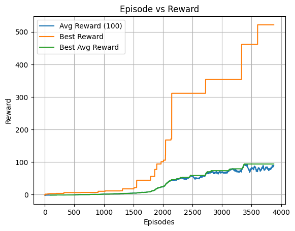
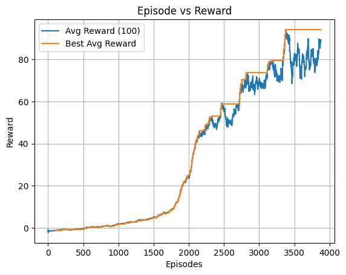
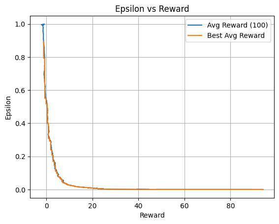
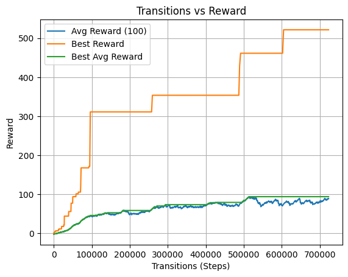

### Testing metrics
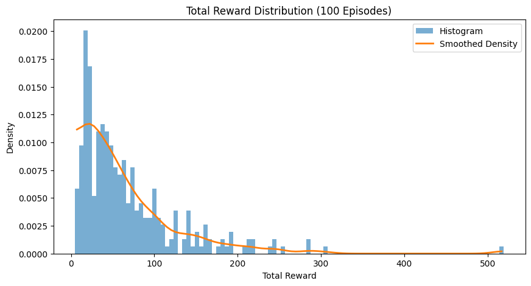
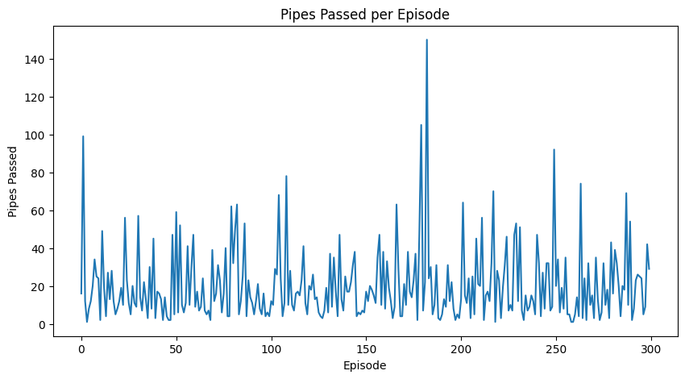

## Other Past Attempts
## v1


## Hyperparameters

```python
# Environment
frame_skip = 4

# Training
data_type = torch.float32
batch_size = 64
T_iterations = 50000 

# Replay buffer
replay_buffer_size = 20000
# DQN
alpha = 1e-4
gamma = 0.99

# Target network (soft update)
target_network_incorporation_rate = 0.005

# Epsilon-greedy
e_start = 1.0
e_end = 0.01
k_epsilon = -1 / T_iterations * np.log(e_end / e_start)
```

## Metrics v1
### Training metrics
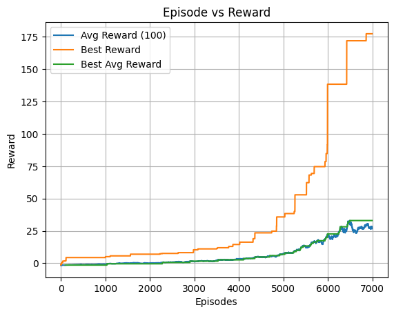
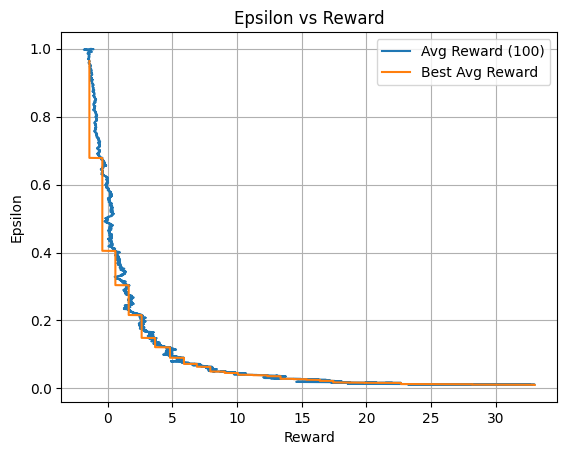
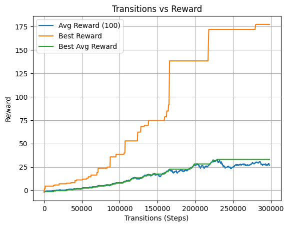


  
## Contributing
Developed by Iancu Stefan-Teodor for academic purposes. Submit pull requests or open issues for suggestions.

## License
MIT License. For academic use only, not licensed for commercial purposes.

## Connect with Me
[LinkedIn](https://www.linkedin.com/in/stefan-teodor-iancu-152a6a284/)


